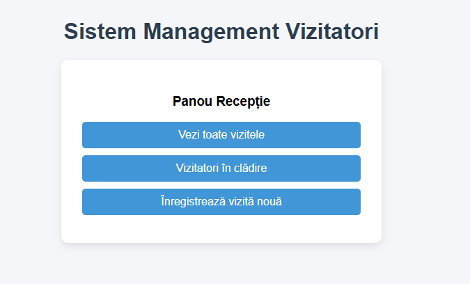
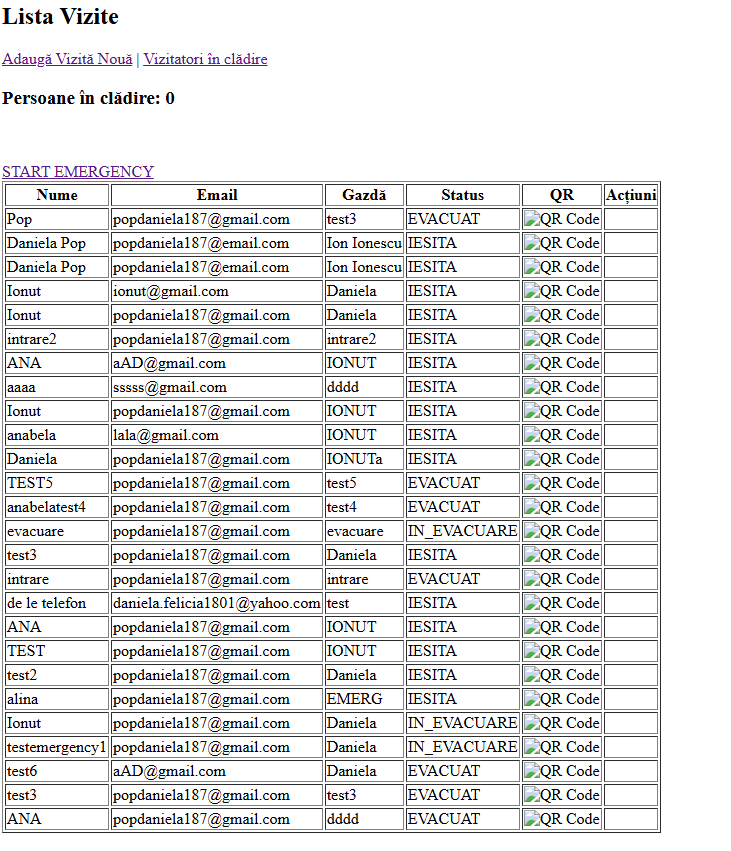
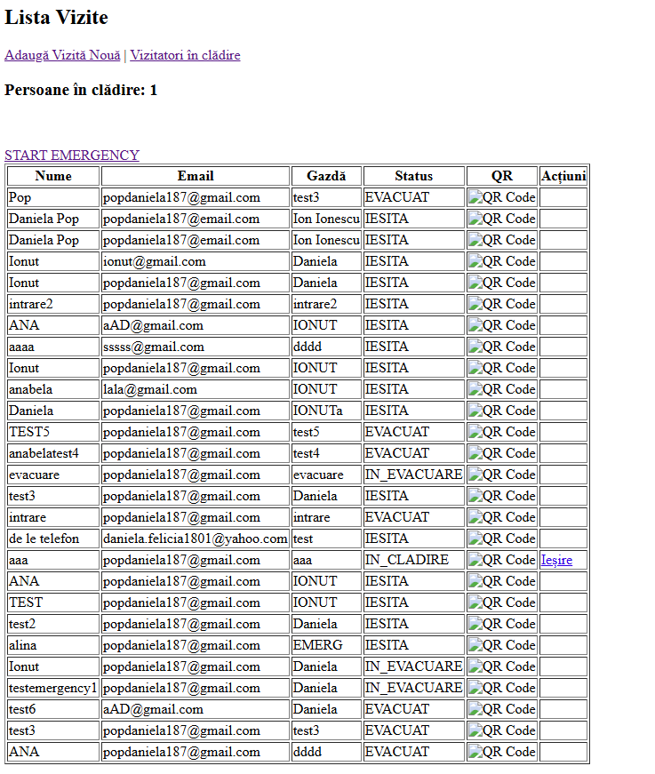

# Visitor Management System- SSATR IA 2025

**Student:** Pop Daniela-Felicia  
**Scenario:** 10. Visitor/Contractor Sign-In System 

---

## Project Overview

Acest proiect implementează un sistem inteligent de înregistrare și gestionare a vizitatorilor într-o clădire modernă. Sistemul permite programarea vizitelor, generarea și trimiterea automată a codurilor QR pentru acces, monitorizarea în timp real a persoanelor aflate în clădire și trimiterea QR prin email.

Scopul principal este simularea unui sistem real de control acces și siguranță, incluzând funcționalități precum expirarea automată a permiselor și gestionarea situațiilor de urgență.

### Key Features

- Feature 1: Generare și trimitere automată QR Code prin email pentru fiecare vizită programată.
- Feature 2: Monitorizare în timp real a persoanelor aflate în clădire (Headcount)
- Feature 3: Monitorizare în timp real a persoanelor aflate în clădire (Headcount)
- Feature 4: Expirare automată a permiselor de acces după un interval de timp prestabilit.

---

## Technology Stack

### Backend
- Java 21
- Spring Boot 3.5.12
- Spring Data JPA
- PostgreSQL
- Spring Data JPA

### Frontend
- Thymeleaf
- HTML/CSS

### Infrastructure
- Embedded Tomcat
- Maven

### Additional Tools/Libraries
- ZXing (generare QR Code)
- Spring Mail (SMTP Gmail)
- Jakarta Mail (Angus Mail)
- HikariCP (connection pooling)
- Spring Scheduling (pentru expirare automată)

---

## System Architecture

### High-Level Architecture

Sistemul este construit pe o arhitectură stratificată (Layered Architecture):
Utilizator (Browser)
→ Controller (Spring MVC)
→ Service Layer
→ Repository Layer (Spring Data JPA)
→ PostgreSQL Database

Email-urile sunt trimise prin protocol SMTP folosind Gmail și autentificare prin App Password.

**Main Components:**

1. **VizitaController**: gestionează cererile HTTP, scanarea QR, intrarea/ieșirea din clădire, headcount-ul și evacuarea.
2. **EmailService**: responsabil pentru trimiterea email-urilor
3. **VizitaRepository**: interfață JPA pentru operații CRUD și interogări bazate pe status.
4. **QRGenerator**:  generează coduri QR ce conțin URL-ul de acces pentru scanare.

### Data Flows

Sistemul gestionează mai multe fluxuri principale de date.

#### Data Flow 1 - Scanarea QR
1. Vizitatorul scanează QR code-ul primit pe email.
2. Cererea este trimisă către backend.
3. Backend verifică dacă permisul este valid sau expirat.
4. Statusul vizitei este actualizat în baza de date prin"PROGRAMAT: ,:IN_CLADIRE" SAU :IESIT".
5. Gazda primește notificare email la intrare cu codul QR.

#### Data Flow 2 - Programarea vizitei
1. Administratorul introduce datele vizitatorului.
2. Sistemul salvează vizita în baza de date cu status PROGRAMATA.
3. Se generează un QR Code unic.
4. QR-ul este trimis automat pe email.

#### Data Flow 3 – Evacuare de urgență
1. Administratorul apasă butonul „Evacuare”.
2. Sistemul interoghează toate vizitele cu status IN_CLADIRE.
3. Se afișează lista persoanelor prezente.
4. Administratorul apasa manual pe confirmarea evacuarilor.
---

### Simulations and Simplifications

Pentru realizarea prototipului au fost aplicate următoarele simplificări:

Example:
- Scanarea QR este simulată prin accesarea unui URL.
- Nu există integrare cu echipamente fizice de control acces.
- Sistemul de evacuare este declanșat manual din interfața web.
- Nu există integrare cu sisteme externe enterprise (ERP, Active Directory etc.).

## Screenshots

   ### Main Dashboard


### Lista de vizite


### Persoane în clădire


### Scanare QR / Badge


### Email trimis

---

## Database Schema

Principala entitate este tabela visits.
Câmpuri principale:
- id (UUID) – identificator unic
- visitor_name – numele vizitatorului
- email – email vizitator
- host_name – numele gazdei
- start_time – data și ora programării
- expiration_time – data și ora expirării
- entry_time – ora intrării
- exit_time – ora ieșirii
- status – PROGRAMATA / IN_CLADIRE / IESITA 
- visitor_type – tip vizitator (Visitor / Contractor /VIP)

Baza de date utilizează PostgreSQL, iar accesul la date este realizat prin Spring Data JPA.

---

## Running the Application

### Prerequisites

- Java 21
- PostgreSQL
- Maven 3.8+
- Cont Gmail cu autentificare in doi pasi aplicata
- Parola pentru aplicatii 

### Setup Instructions

1. **Clone the repository**
```bash
   git clone [https://github.com/studenty5/ssatr-lab-DanielaPop.git]
   cd [ssatr-lab-DanielaPop/visitor-system-web]
```

2. **Configure**
```bash

 - Database [CREATE DATABASE facility_access]
 - Configure Email (Gmail App Password) [ in application.properties:
spring.mail.host=smtp.gmail.com
spring.mail.port=587
spring.mail.username=emailul_tau@gmail.com
spring.mail.password=parola_pentru_aplicatii
spring.mail.properties.mail.smtp.auth=true
spring.mail.properties.mail.smtp.starttls.enable=true]
```

3. **Build the application**
```bash
   mvn clean install
```

5. **Run the application**
```bash
   mvn spring-boot:run
```

6. **Access the application**
   - Web Interface: http://localhost:8080
   - Lista Vizite: http://localhost:8080/vizite

---

## Challenges and Solutions

OPTIONAL:

**Challenge 1:** Autentificare Gmail prin SMTP

**Solution:** Activarea autentificării în doi pași și generarea unei parole pentru aplicații ce a fost folosita in partea de cod (App Password).

**Problem no.1:** Totul functioneaza doar daca nu se modifica agresa de mail.

**Challenge 2:** Gestionarea corectă a statusurilor la scanări repetate]  
**Solution:** Implementarea unei logici clare de tranziție între statusuri (PROGRAMATA → IN_CLADIRE → IESITA)

**Challenge 3:** Implementarea expirarii automate
**Solution:** Utilizarea unui task programat (Spring Scheduling) și verificarea expirationTime la fiecare scanare.
---

## Future Improvements

În această secțiune sunt incluse funcționalitățile care nu au putut fi implementate complet în cadrul proiectului, dar care ar reprezenta îmbunătățiri importante pentru o versiune viitoare a sistemului.

Deși aplicația este funcțională și îndeplinește cerințele de bază ale scenariului ales, există mai multe limitări și aspecte care pot fi optimizate:
- Implementarea unui mecanism mai robust de gestionare a scanărilor QR, astfel încât să fie prevenite scanările multiple consecutive sau utilizarea abuzivă a codurilor.
- Îmbunătățirea managementului situațiilor de urgență, prin automatizarea procesului de evacuare și introducerea unui sistem de confirmare a prezenței după evacuare.
- Implementarea completă a unui sistem de trimitere automată a mesajelor de avertizare prin email către toți vizitatorii aflați în clădire în cazul declanșării unei situații de urgență (funcționalitate nefinalizată din cauza limitărilor tehnice și de timp).
- Introducerea unui sistem de autentificare și autorizare pe roluri (Administrator, Security, Host).
- Dezvoltarea unei interfețe mai avansate pentru monitorizare în timp real (de exemplu utilizând WebSocket).
- Restricționarea accesului în funcție de tipul vizitatorului și de zonele clădirii.
Aceste îmbunătățiri ar transforma aplicația dintr-un prototip funcțional într-un sistem mult mai apropiat de un produs utilizabil într-un mediu real.]

- [Improvement]


